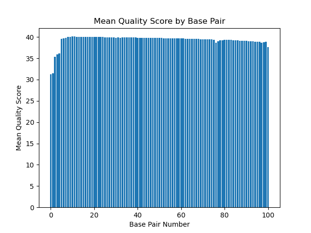
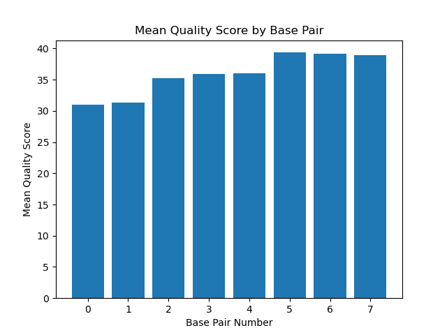
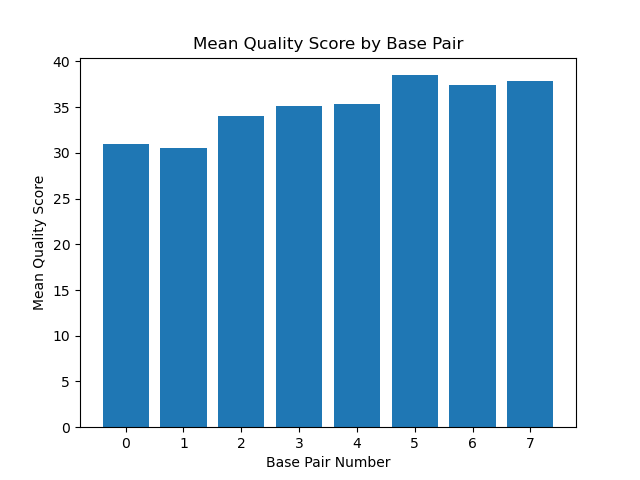
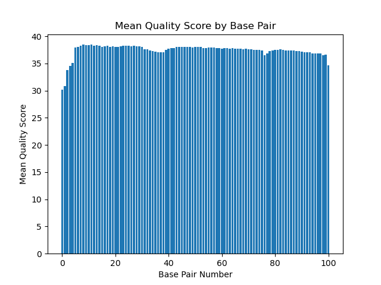

# Assignment the First

## Part 1
1. Be sure to upload your Python script. Provide a link to it here: [meandist.py](meandist.py)

| File name | label | Read length | Phred encoding |
|---|---|---|---|
| 1294_S1_L008_R1_001.fastq.gz | read 1 | 101 | +33 |
| 1294_S1_L008_R2_001.fastq.gz | index 1 | 8 | +33 |
| 1294_S1_L008_R3_001.fastq.gz | index 2 | 8 | +33 |
| 1294_S1_L008_R4_001.fastq.gz | read 2 | 101 | +33 |

2. Per-base NT distribution
    1. Use markdown to insert your 4 histograms here.
    
    RUN 1: 
    

    RUN 2: 
    

    RUN 3:
    

    RUN 4: 
    

    2. What is a good quality score cutoff for index reads and biological read pairs to utilize for sample identification and downstream analysis, respectively? Justify your answer. 

    **For index reads, 20 is an appropriate quality score cutoff because that will give us a 99% confidence level that we have the correct read for that base.**
    **For biological reads, we don't need a quality score cutoff because next we will align to a genome, so the aligner will take care/not align low quality reads.**

    3. How many indexes have undetermined (N) base calls? (Utilize your command line tool knowledge. Submit the command(s) you used. CHALLENGE: use a one-line command)

    **$ zcat /projects/bgmp/shared/2017_sequencing/1294_S1_L008_R2_001.fastq.gz | sed -n '2~4p'| grep "N" | wc -l**
   
    **3976613**

    **$ zcat /projects/bgmp/shared/2017_sequencing/1294_S1_L008_R3_001.fastq.gz | sed -n '2~4p'| grep "N" | wc -l**
   
    **3328051**
    
## Part 2
1. Define the problem: de-multiplex files and report index-hopping
2. Describe output: 52 files
```bash
unknown_R1.fastq
unknown_R2.fastq
hopped_R1.fastq
hopped_R2.fastq
knownindex1_R1.fastq
knownindex1_R2.fastq
knownindex2_R1.fastq
knownindex2_R2.fastq
...
knownindex24_R1.fastq
knownindex24_R2.fastq
```

3. Upload your [4 input FASTQ files](../TEST-input_FASTQ) and your [>=6 expected output FASTQ files](../TEST-output_FASTQ).

4. Pseudocode
```python
'''
covert matched index textfile to set

open all 4 input files (using 'a')
  while True:
    read 4 lines (1 record) from all files
    if line == "": break

    reverse compliment index 2
    edit all the headers w/ index 1 seq-index2 seq

    if index 1 & index 2 not in set of 24 known index OR average q score is < q score threshold
      unknown +=1
      write R1 record to unknown_R1.fq
      write R4 record to unknown_R2.fq
      continue
    else:
      if index 1 == index 2:
        matched_dict(index1-index2) += 1
        write R1 record to index_R1.fq
        write R4 record to index_R2.fq
        continue
      else:
        hopped_dict(index1-index2) += 1
        write R1 record to hopped_R1.fq
        write R4 record to hopped_R2.fq
        continue
'''
```

5. High level functions. For each function, be sure to include:
    1. Description/doc string
    2. Function headers (name and parameters)
    3. Test examples for individual functions
    4. Return statement

```python
def reverse_compliment(sequence: str) -> str:
    '''Takes a DNA sequence and returns the reverse compliment of that sequence.'''
    return rev_complimented_sequence
#Input: CAT
#Expected output: ATG
```
```python
def edit_header(R1_header: str, R4_header: str, R2_sequence: str, R3_sequence: str) -> str, str:
    '''Takes 2 headers and 2 indexes, adds the indexes to both headers, and returns the new headers.'''
    return edited_R1header, edited_R4header
#Input: @K00337:83:HJKJNBBXX:8:1101:1265:1191 1:N:0:1, @K00337:83:HJKJNBBXX:8:1101:1265:1191 4:N:0:1, NCTTCGAC, NTCGAAGA
#Expected output: @K00337:83:HJKJNBBXX:8:1101:1265:1191 1:N:0:1 NCTTCGAC-NTCGAAGA, @K00337:83:HJKJNBBXX:8:1101:1265:1191 4:N:0:1 NCTTCGAC-NTCGAAGA
```
```python
def check_qscore(R2_qscores: str, R3_qscores: str, qscore_threshold: int) -> bool:
    '''Takes the qscores of both index files, converts them, averages them, and compares them to the threshold. Returns True or False.'''
    return bool
#Input: EEEEEEE, FFFFFFF, 32
#Expected output: False
```
